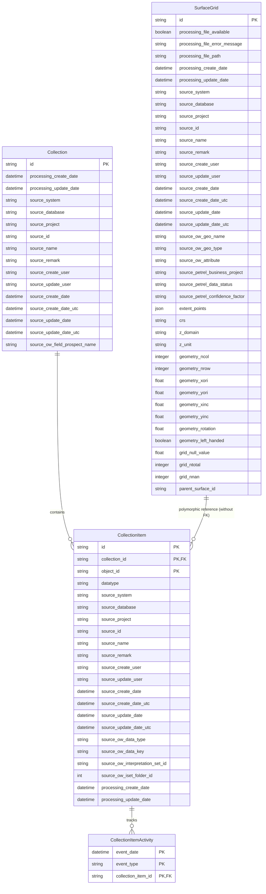

```mermaid
erDiagram
    SurfaceGrid {
        string id PK
        boolean processing_file_available
        string processing_file_error_message
        string processing_file_path
        datetime processing_create_date
        datetime processing_update_date
        string source_system
        string source_database
        string source_project
        string source_id
        string source_name
        string source_remark
        string source_create_user
        string source_update_user
        datetime source_create_date
        datetime source_create_date_utc
        datetime source_update_date
        datetime source_update_date_utc
        string source_ow_geo_name
        string source_ow_geo_type
        string source_ow_attribute
        string source_petrel_business_project
        string source_petrel_data_status
        string source_petrel_confidence_factor
        json extent_points
        string crs
        string z_domain
        string z_unit
        integer geometry_ncol
        integer geometry_nrow
        float geometry_xori
        float geometry_yori
        float geometry_xinc
        float geometry_yinc
        float geometry_rotation
        boolean geometry_left_handed
        float grid_null_value
        integer grid_ntotal
        integer grid_nnan
        string parent_surface_id
    }

    Collection {
        string id PK
        datetime processing_create_date
        datetime processing_update_date
        string source_system
        string source_database
        string source_project
        string source_id
        string source_name
        string source_remark
        string source_create_user
        string source_update_user
        datetime source_create_date
        datetime source_create_date_utc
        datetime source_update_date
        datetime source_update_date_utc
        string source_ow_field_prospect_name
    }

    CollectionItem {
        string id PK
        string collection_id PK, FK
        string object_id PK
        string datatype
        string source_system
        string source_database
        string source_project
        string source_id
        string source_name
        string source_remark
        string source_create_user
        string source_update_user
        datetime source_create_date
        datetime source_create_date_utc
        datetime source_update_date
        datetime source_update_date_utc
        string source_ow_data_type
        string source_ow_data_key
        string source_ow_interpretation_set_id
        int source_ow_iset_folder_id
        datetime processing_create_date
        datetime processing_update_date
    }

    CollectionItemActivity {
        datetime event_date PK
        string event_type PK
        string collection_item_id PK, FK
    }

    Collection ||--o{ CollectionItem : "contains"
    CollectionItem ||--o{ CollectionItemActivity : "tracks"
    SurfaceGrid ||--o{ CollectionItem : "polymorphic reference (without FK)"
```
