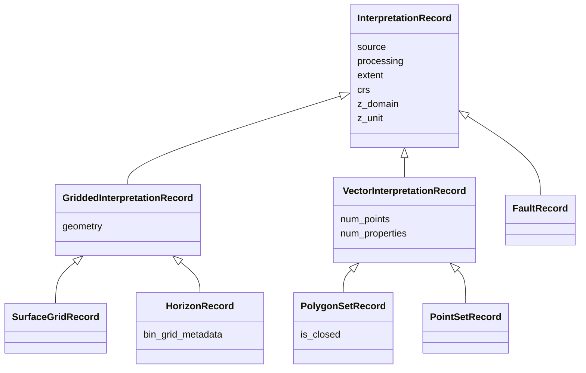

# Design Guidelines: Models

## Overview

This document describes how semantic models should be designed in the `interpretation-models` repository for objects of interpretation datatypes — horizons, faults, surface grids, polygons, point sets.
The handling of collections/ISets, though part of the model, is described separately.

The interpretation semantic model is built around two concepts:

1. **InterpretationRecord**
  Structured semantic description of an interpretation object, composed of common attributes, geometry structure, and contextual metadata.

2. **Interpretation**
  A wrapper containing an `InterpretationRecord` plus its associated data arrays and an optional object containing validation results for the record.

---

## InterpretationRecord

`InterpretationRecord` is the semantic base class for all internal interpretation models.

As a general rule, InterpretationRecord is a base/abstract model from which every interpretation model output class should derive (e.g. SurfaceGridRecord, or PolygonRecord), adding more specialized attributes as needed.

It contains information that belongs to any spatial interpretation, such as coordinate reference, domain, z_unit, extent, and also includes specialized (optional) metadata produced by the sources or processing clients.

Concrete datatypes inherit from `InterpretationRecord`, directly or through the two intermediate classes upon which we divide interpretations based on whether they are points over a regular grid (surface grids and horizons) or defined by vector coordinates (x,y,z) for all subcomponents (polygons, point sets) — more details about the distinction and representations of these two types in [interpretations intro](./interpretations.md).

The example below shows the hierarchy.
It includes example attributes, but the diagram is not guaranteed to comprehensively include all attributes.
For an updated description of all clses and attributes, see the code in [interpretations.py](../src/models/interpretation.py)


### Core Principles

#### 1. Separate semantic models from transport concerns

Models in this repository represent **typed semantic objects**.

They do **not** represent JSON payloads or storage-layer row schemas.
The tables package provides functionality for converting to schemas and JSON object serializations.

#### 2. Favor inheritance for shared meaning

Common concepts should be defined once and inherited where appropriate.

#### 3. Favor composition for context

Metadata with distinct responsibilities should be composed, not flattened into one large class.

For example: source metadata, processing metadata, grid geometry, etc, remain conceptually separate even if later flattened for table storage.
This allows them to be injected into functions.

#### 4. No dependencies to external objects

One interpretation record should never depend on other objects.
It should always be possible to define an object such as the input of the source object(s) and optional processing metadata is enough to define the object.
Therefore, collections/ISets or any type of objects lists are always handled separately from the record.

#### 5. Minimum amount of required attributes

In this repo, we intentionally design for validations to be run separately (both the records/metadata and in the bulk data).
This allows the caller has control over what to do when a validation fails.
In some cases, the caller might want to fail the operation, and not save an invalid record (for example, missing a key attribute, such as geometry or id).
In other cases, it might want to save the record anyway, and flag it as invalid/missing data.
In [the validation design](./design_validation.md), we discuss some strategies of this implementation.
However, due to this design, we recommend the records have a minimum amount of required fields, such that the mappers don't throw errors when trying to create an interpretation record without all the attributes.


### Source Metadata

Source metadata is a composable object part of the interpretation record, representing metadata attributes that are directly generated by the source.
Examples:
- native identifiers
- names, aliases, or remarks
- timestamps and users for creation/update

Metadata that exists only on specific sources (e.g. geo_name for OpenWorks or confidence_factor for Petrel) is included as attributes in the SourceMetadata, with composable classes like OpenWorksMetadata and PetrelMetadata.
This allows the model to remain consistent across systems while still preserving source-specific detail.

The reason to do that instead of creating classes that inherit from SourceMetadata and add specific attributes is to allow the schema for the record to be the same, regardless of the source for the data.
When (if) exporting the interpretation model objects into tables, they will generate rows following a schema that includes metadata from all sources, but only a few of them are expected to be filled depending on which source it comes from.

As this model evolves, some of this metadata can eventually be modelled into other attributes common to sources.
As an example, the geo_name is used in OpenWorks, and can be mapped to strat columns in the interpretation model.
The challenge for that is that this type of attribute usage is not enforced by the sources and may be used inconsistently and with different purposes across assets.

### Source Context

For sources where there are multiple independent projects, the actual object identifier is a combination of the source object id + the project and database where that object lives, since the same object id can exist (especially when the identifier is a sequence and not a guid as is the case in OpenWorks).
Thus, the source system, source project and source database are required attributes for all interpretations.

However, this information is usually not present at the object response as it comes from the source.
Typically, the user queries a database and project, and receives an object which, within that database and project, is uniquely identifiable.
Therefore, we need to provide the processing client a way to inform the database and project *outside* the typed object that represents the response it receives from the source server, so that those attributes can be added to the InterpretationRecord.

For that, we include the `SourceContext` class, which includes database + project.
The source system is not part of SourceContext — it is hardcoded by each mapper, since a mapper is already specific to a source.
This class is separate from `SourceMetadata` only to be provided as additional input to the mapper.
SourceContext is mapper input only; its values are copied into SourceMetadata in the resulting record.

### Processing Metadata

ProcessingMetadata represents metadata supplied by the caller of the mapper, typically a processing script or pipeline.

Examples:

- processing timestamps (create/update/delete)
- client-assigned UUIDs
- soft deletion markers
- execution-related context

ProcessingMetadata is optionally composed into InterpretationRecord, and not required to construct the object.
The reason why it is included in the record models, despite not being part of domain semantics, is to facilitate the generation of table schemas based on these models.

This allows the internal model to be used the same way in lightweight metadata mapping, tests and notebooks, as it is in full processing flows.

### Suggestion on importing

Because this repository maps between models that represent the same concepts in different systems, naming overlap is very likely.
The internal interpretation models try to reduce ambiguity by using names that are more specific than the raw datatype name (for example SurfaceGridRecord and SurfaceGridInterpretation rather than just SurfaceGrid), but collisions are still possible.
For example, names such as HorizonInterpretation and FaultInterpretation also have specific meanings in RESQML.
To keep code readable and unambiguous, the recommended pattern is to import model packages using explicit aliases.

For example:

```
import dsis_model_sdk.models.common as ow_common
import dsis_model_sdk.models.native as ow_native
import interpretation_models.models as interp
import pyetp.resqml_objects.data_types as resqml_types


ow_surface: ow_common.SurfaceGrid = dsis_fetch(...)
surface_record:  interp.SurfaceGridRecord = map_surfacegrid(ow_surface, ...)
regular_grid_params = resqml_types.RegularGridParameters (shape = (surface_record.ncols, surface_record.nrows), ...)
```

This convention should be followed in the mappers package.

### Metadata Mappers

Mappers between the interpretation models and other source/target models are the main API of this repository.
The most important and stable mapper interface is the **metadata mapper**.

A metadata mapper:
- accepts a typed source-model object
- accepts a `SourceContext` to include source system/database/project in the returned object
- accepts optional `ProcessingMetadata` to include additional info created in processing, such as timestamps and status
- returns a typed `InterpretationRecord`

Mappers operate on typed source-model objects, not raw JSON responses.
This repository assumes that transport-specific deserialization has already been taken care of.
As an example, for OpenWorks objects, the input parameter of each mapper should be one or more of (or a union of) models in [dsis-schemas](https://github.com/equinor/dsis-schemas/tree/main/dsis_model_sdk/models).

The mappers should always return a specialized InterpretationRecord Type (e.g. SurfaceGridRecord), never an object of the base class InterpretationRecord, even if they don't add any more attributes.
This is for legibility and extensibility, in case the classes are updated.

Metadata mappers should be easy to unit test, therefore it is important to not include anything in the input that cannot be easily replicated by a mock version of a source object.

---

## Interpretation

Interpretation is a wrapper object that contains:

- mandatory: InterpretationRecord (metadata)
- optional: bulk data
- optional: validation report


The semantics of an Interpretation containing metadata + bulk_data also adheres to the principles described in
[interpretations intro](../docs/interpretations.md).

### Full mappers as convenience APIs

This wrapper exists to make the library flexible enough to support different workflows and use cases.
Some workflows only require metadata mapping, doing the bulk data processing elsewhere, for example at a separate pipeline step;
while others may expect doing the mapping of metadata and arrays together.
Both workflows are supported using this wrapper as an output of a convenience mapper that:

- calls the metadata mapper internally
- optionally accepts raw bulk data and converts it as well
- optionally performs validation and includes the results
- returns a typed interpretation wrapper

This also enables simpler unit testing and clearer separation between semantics and payload.
When present, the bulk data **output** will be numpy ndarrays.
See [bulk data models](./bulk_data_models.md) for more details on the format and orientation of arrays.

Full mappers must still be callable with bulk_data=None.
So, in essence, calling a full mapper with bulk data set to None and validation mode to "none" should be equivalent to calling the metadata mapper by itself.

### Typed interpretation wrappers

The generic wrapper `Interpretation[TRecord]` should be specialized into thin, datatype-specific concrete classes.

The purpose of these thin wrappers is to preserve strong typing for callers and avoid erasing datatype information behind a generic Interpretation.

Examples:

```python
class SurfaceGridInterpretation(Interpretation[SurfaceGridRecord]):
    pass

class HorizonInterpretation(Interpretation[HorizonRecord]):
    pass
```

### Validation modes

Validation is optionally run in both metadata and bulk data, and should be controlled by a mode parameter rather than a boolean flag, to avoid ambiguity:

- "none" : Do not perform validation.
- "metadata": Validate the record only.
- "full": Validate the record and the bulk data (if available).
