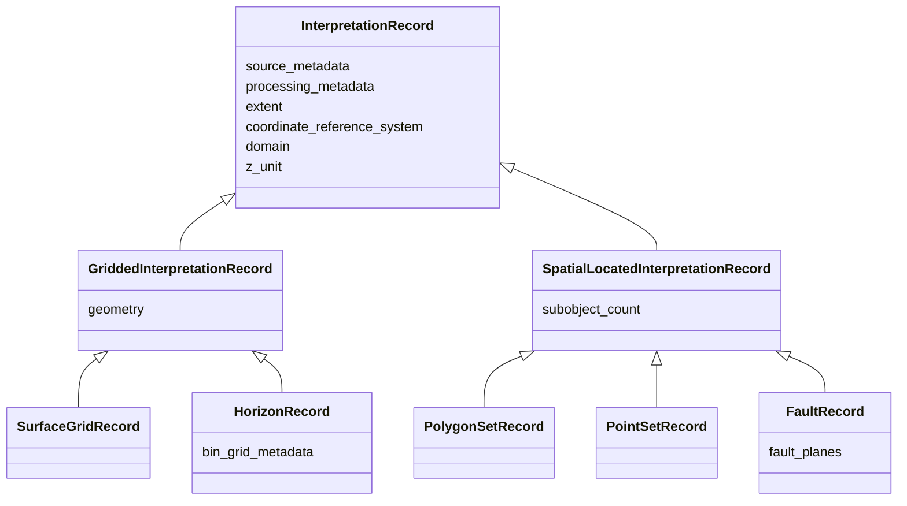

# Design Guidelines: Models

## Overview

This document describes how semantic models should be designed in the `interpretation-models` repository.

The interpretation semantic model is built around two concepts:

1. **InterpretationRecord**  
  Structured semantic description of an interpretation object, composed of common attributes, geometry structure,
  and contextual metadata.

2. **Interpretation**  
  A wrapper containing an `InterpretationRecord` plus its associated data arrays and an optional object containing
  validation results for the record.

---

## InterpretationRecord

`InterpretationRecord` is the semantic base class for all internal interpretation models.

As a general rule, InterpretationRecord is a base model from which every interpretation model output class should
derive (e.g. SurfaceGridRecord, or PolygonRecord), adding more specialized attributes as needed.

It contains information that belongs to any spatial  interpretation, such as coordinate reference, domain, z_unit,
extent, and also includes specialized (optional) metadata produced by the sources or processing clients.

Concrete datatypes inherit from `InterpretationRecord`, directly or through the two intermediate classes upon which we
divide interpretations based on whether they are points over a regular grid (surface grids and horizons) or defined by
spatial coordinates (x,y,z) for all subcomponents (polygons, point sets, faults). 

### Example hierarchy


###  Core Principles

#### 1. Separate semantic models from transport concerns

Models in this repository represent **typed semantic objects**.

They do **not** represent JSON payloads or storage-layer row schemas. The tables package provides functionality for
converting to schemas and json object serializations.

#### 2. Favor inheritance for shared meaning

Common concepts should be defined once and inherited where appropriate. Use inheritance only for true semantic specialization.

#### 3. Favor composition for context

Metadata with distinct responsibilities should be composed, not flattened into one large class.

For example:  source metadata, processing metadata, grid geometry, etc, remain conceptually separate even if later
flattened for table storage. This allows them to be injected into functions.

###  Source Metadata
Source metadata is a composable object part of the interpretation record, representing metadata attributes that are
directly generated by the source. Examples:
- native identifiers
- names, aliases, or remarks
- timestamps and users for creation/update 

Metadata that exists only on specific sources (e.g. geo_name for OpenWorks or confidence_factor for Petrel) is
included as attributes in the SourceMetadata, with composable classes like OpenWorksMetadata and PetrelMetadata.
This allows the model to remain consistent across systems while still preserving source-specific detail.

The reason to do that insted of creating classes that inherit from SourceMetadata and add specific attributes is to
allow the schema for the record to be the same, regardless of the source for the data. When (if) exporting the
interpretation model objects into tables, they will generate rows following a schema that includes metadata from all
sources, but only a few of them are expected to be filled depending on which source it comes from.

As this model evolves, some of this metadata can eventually be modelled into other attributes common to sources.
As an example, the geo_name is used in OpenWork, and can be mapped to strat columns in the interpretation model.
The challenge for that is that this type of attribute usage is not enforced by the sources may be used inconsistently
and with different purposes across assets.

### Source Context

For sources where there are multiple independent projects, the actual object identifier is a combination of the 
source object id + the project and database where that object lives, since the same object id can exist (especially
when the identifier is a sequence and not a guid as is the case in OpenWorks). Thus, the source system, source project
and source database are required attributes for all interpretations.

However, this information is usually not present at the object response as it comes from the source. Typically, the user
queries a database an project, and receives an object which, within that database and project, is uniquely identifiable.
Therefore, we need to provide the processing client a way to inform the database and project *outside* the typed object
that represents the response it receives from the source server, so that those attributes can be added to the
InterpretationRecord.

For that, we include the `SourceContext` class, which includes source_system + db_name + project_name.
This class is separate from `SourceMetadata` only to be provided as additional input to the mapper.
When the mapper processes the `SourceContext` plus the source object, it generates `SourceMetadata` as 
part of the resulting record, and that includes the attributes present in `SourceContext` as well, flattened.

### Processing Metadata

ProcessingMetadata represents metadata supplied by the caller of the mapper, typically a processing script or pipeline.
Examples:

- processing timestamps (create/update/delete)
- client-assigned UUIDs
- soft deletion markers
- execution-related context

ProcessingMetadata is optionally composed into InterpretationRecord, and not required to construct the object.
This allows the same internal model to be used the same way in in lightweight metadata mapping, tests and notebooks as it is
in full processing flows.
Due to  its nature, Processing Metadata is not partof the input source object, and has to be (optionally) provided to
the mapper to be included in the resutling InterpretationRecord.

---

## Interpretation

Interpretation is a wrapper object that contains:

- mandatory: InterpretationRecord (metadata)
- optional: bulk data
- optional: validation report

This wrapper exists to make the library flexible enough to support different workflows and use cases:
- mapping of metadata only between a source model and InterpretationRecord
- mapping of both source metadata and raw payload to an Interpretation record and the arrays with data points
- in either of the cases, optionally apply validations to the metadata
 
Some workflows only require metadata mapping, doing the bulk data processing elsewhere, for example at a separate
pipeline step, while others may expect doing the mapping of metadata and arrays together. Both workflows are supported
using this wrapper as an output of a mapper that aduequatly acccepts source metadata + raw bulk data and converts both.

The semantics of an Interpretation containing metadata + bulk_data also adheres to the principles descried in 
[intepretations intro](../docs/interpretations.md)

This also enables simpler unit testing and clearer separation between semantics and payload.
When present, the bulk data output will be numpy nparrays.

### Typed interpretation wrappers

The generic wrapper class `Interpretation[TRecord]` should be specialized into thin, datatype-specific concrete classes.
These classes should remain thin wrappers over the generic base.

The purpose of these thin wrappers is to preserve strong typing for callers, making mapper return types explicit, and
avoiding erasing datatype information behind a generic Interpretation.

Examples:

```python
class SurfaceGridInterpretation(Interpretation[SurfaceGridRecord]):
    pass

class HorizonInterpretation(Interpretation[HorizonRecord]):
    pass
```

### Suggestion on importing

Given the main objective of this repo is to convert between models that represent the same concepts in different
systems, there is a strong chance of naming overlap. We try to keep the names in the interpetation models specify
something more than jsut the datatype name (i.e. SurfaceGridRecord and SurfaceGridIntepretation as opposed to pure
SurfaceGrid), but there is always chance of collision. For example, in RESQML, HorizonInterpretation and
FaultInterpretation have a different meaning.

The suggestion to avoid ambiguity is to import the packages from different models with aliases. For example:

```
import dsis_model_sdk.models.common as ow_common
import dsis_model_sdk.models.native as ow_native
import interpretation_models.models as interp
import pyetp.resqml_objects.data_types as resqml_types


dsis_grid: ow_common.SurfaceGrid = dsis_fetch(...)
grid_record:  int_model.SurfaceGridRecord = ow_to_interpretation(dsis_grid, ...)
grid_params = resqml_model.RegularGridParameters (shape = (grid_record.ncols, grid_record.nrows), ...)
```
---

## Gridded interpretations specifics

For gridded interpretations, the arrays should follow the RegularSurface described in 
https://xtgeo.readthedocs.io/en/latest/datamodels.html#description: 

> A 2D array (masked numpy) of values, for a total of ncol * nrow entries. Undefined map nodes are masked. 
> The 2D numpy array is stored in C-order (row-major). Default is 64 bit Float.

All of the parameters necessary to describe the surface in that model (rotation, origin x and y, increments, ncol and nrow)
are stored in the Geometry class, which is composed into GriddedInterpretationRecord as anattribute.
In addition, left-handedness is a boolean that describes the relative orientation of the axis, equivalent to yflip in xtgeo.
For surface grids, this is not relevant due to the rows always being oriented clockwise from the cols. For horizons, this
plays a role, as with the extra alignment of inlines and crosslines, this relative orientation may be reversed.

#### Surface grids row orientation

Assume a 2D array with 3 cols and 4 rows for a gridded representation looks like this (remember a np 2d aray is a list of
columns, each with a list of row values for that column):
```
[[00, 01, 02, 03], [10, 11, 12, 13], [20, 21, 22, 23]]
``` 

If oriented along the cols and rows as defined in a RegularSurface, with the origin at the bottom left of the local grid,
the cols will count from left to right, and inside them, rows count from bottom to top.
This can be thought of as following the same representation of a cartesian grid.

```
03   13   23
02   12   22
01   11   21
00   10   20
```

This differs from the OpenWorks SurfaceGrid representation of the bulk data (LGCStructure),
where the columns also count to the left, but the rows count from top to bottom.
It can be thought of as following the same representation of a matrix or spreadsheet.
If the same 2D array was interpreted in OpenWorks, it would look like this

```
00  10   20
01  11   21
02  12   22
03  13   23
```

This is why the parameter "cartesian_origin" is set to true when converting from OW to interpretation model. 
The method and parameter are defined in 
https://github.com/equinor/dsis-schemas/blob/d235aa983b4e0e945f4ff54e80e8537b787d8be5/dsis_model_sdk/utils/protobuf_decoders.py#L340
